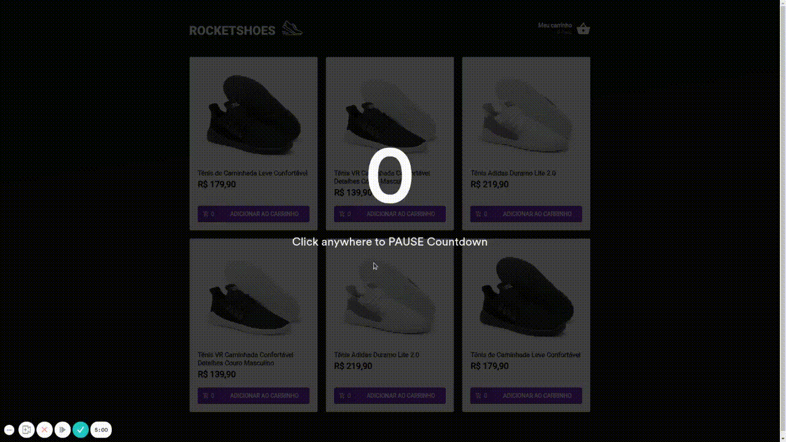

<div align="center">

<h3>


Desafio do Programa Ignite - Trilha ReactJS - da [Rocketseat]

</h3>

  

</div>

<br>

## 📚 **Sobre**

Aplicação de carrinho de compras. O desafio consiste em criar um hook que acrescente as seguintes funcionalidades:

- Adicionar um novo produto ao carrinho;
- Remover um produto do carrinho;
- Alterar a quantidade de um produto no carrinho;
- Cálculo dos preços sub-total e total do carrinho;
- Validação de estoque;
- Exibição de mensagens de erro;

<br>

### 📌 **Tecnologias utilizadas**

- React
- Yarn
- Axios
- React-Toastify
- Styled-components
- Polished
- TypeScript

<br>
<br>

### 🚀 **Mão na massa**

```bash
# Clone este repositório
$ git clone https://github.com/felipepxavier/ignite-challenge-02

# Acesse a pasta do projeto no terminal/cmd
$ cd ignite-challenge-02

# Instale as dependências
$ yarn

# Execute a FAKE Api com JSON Server
$ yarn server

# Execute a aplicação em modo de desenvolvimento
$ yarn start


```

<br>
<br>

<h3 align="center">
Feito com 💜 por <a href="https://www.linkedin.com/in/felipe-pedroso-04a648160/">Felipe Pedroso</a>
<br><br>

  
</a>
</h3>

<!-- Links -->

[rocketseat]: https://rocketseat.com.br/
